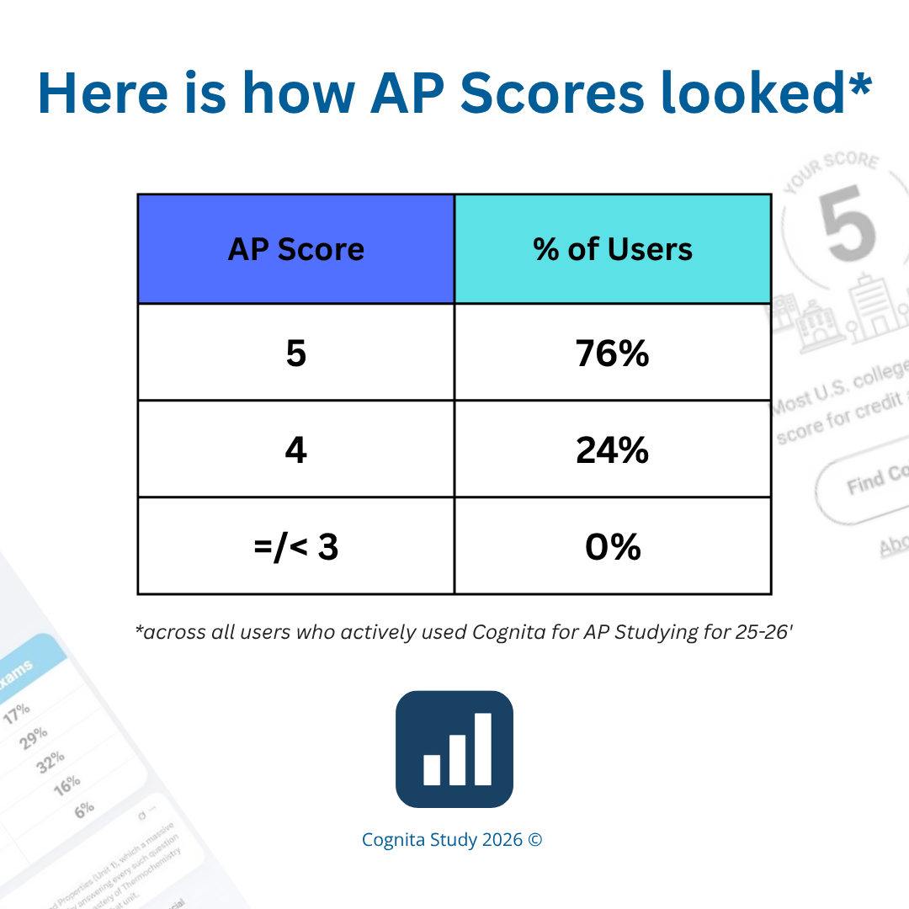
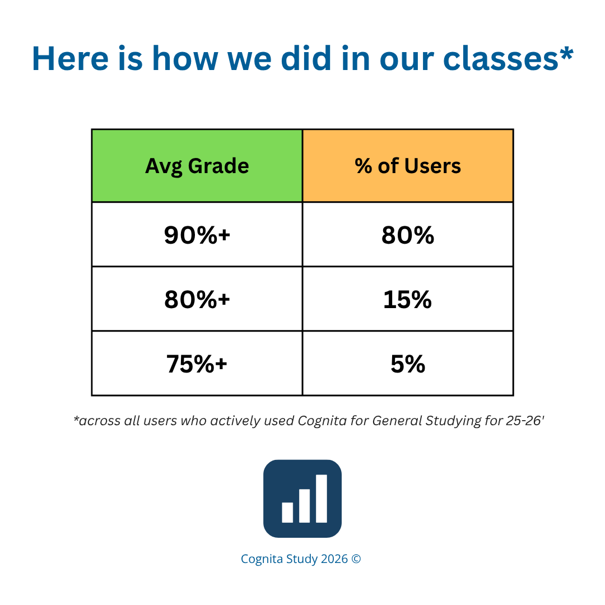
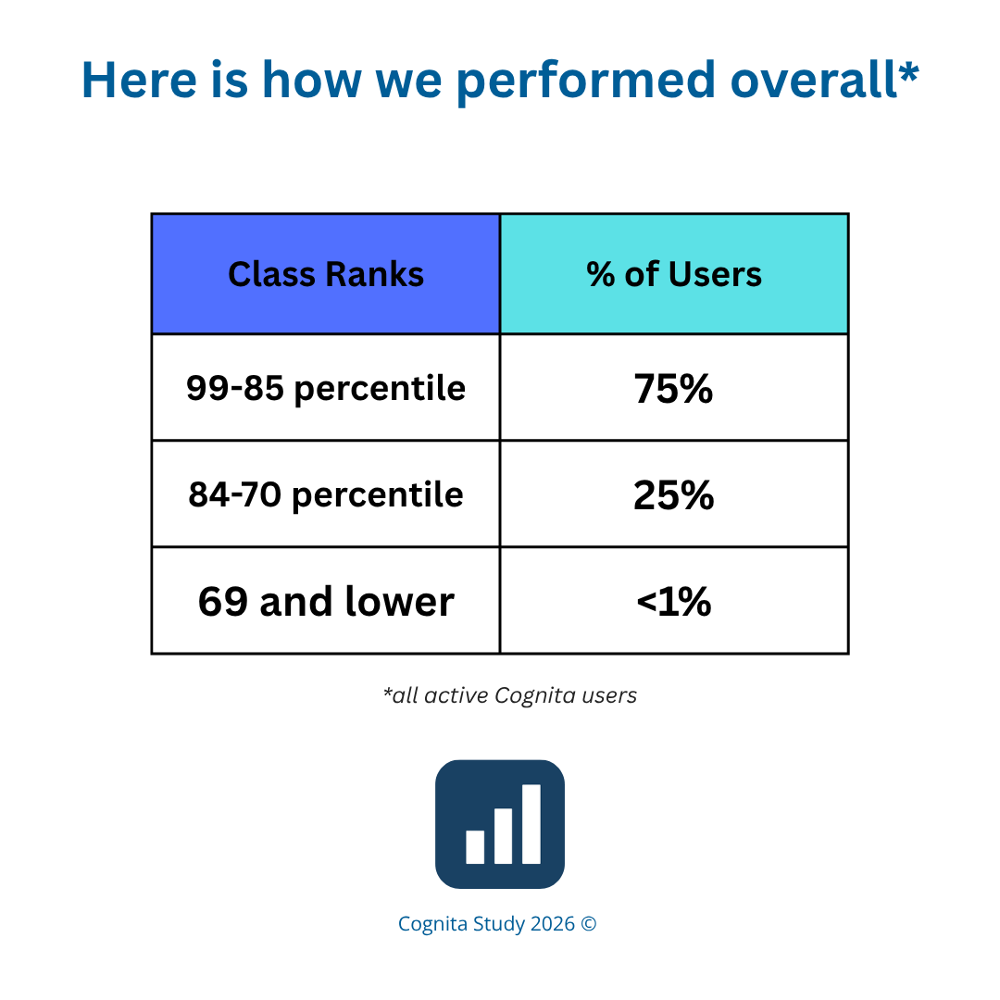

## Cognita Study

## Disclaimer
This is a copy of my functional repo that actually manages the connection to Vercel Deployment. Unfortuantely, I wasn't able to publish my real repo because it's past commits included leaked API keys that I will not want to share. However, below is the list of commits I had done on that repo with no API leaking:

update 404 error - 
fix footer - 
update page not found - 
update documentation routing - 
update app routes - 
update footer and security practices statements as well as documentation - 
remove gitexportpanel - 
update feature shwocases - 
add classroom to search query - 
update tips - 
simplify loading statuses - 
update text in signin page - 
update loading states - 
update welcome UI and buffers. also update home orders - 
add humorous loading lol - 
update new welcome splash - 
update page to link to friends and users - 
update footer logics - 
update footer - 
update text disclaimer - 
fix UI coloring - 
update div to link - 
update deck urls and search bars - 
update home UI once more - 
update home ui - 
update UI text - 
fix footer - 
update home - 
update search menu logic - 
fix layout - 
update home layout - 
fix compass error - 
update new UI - 
update new home style - 
remove unecessary double footer credit - 
remove header branding - 
update new signin photo - 
udpat emobile signin mode - 
update CSS - 
update image sizing - 
move it to public - 
update customsignin - 
update customsignin - 
update loading state text - 
update loading state text - 
update devdashboard holders - 
update profile llogic - 
return to original profile - 
update profile logic - 
update UI message - 
update new custom signin - 
return to original - 
update cognita login - 
fix the broken google signin - 
update custom signin UI - 
fix footer layout - 
fix footer and paypal links - 
return to home - 
update home once more - 
update new Home - 
return to original UI style - 
new UI - 
return to original UI style - 
update home UI - 
update home UI page - 
update UI once more - 
update UI - 
edit model - 
add lazy loading - 
update readme - 
update logic of cover uploads - 
fix deck uploading image errors - 
fix upload image logic - 
fix router mismatch - 
update cover picker - 
fix deck image upload configurations - 
update UI formatting text - 
update UI - 
add checkpoints - 
update UI text - 
update UI text - 
fix study - 
fix UI - 
update study.jsx - 
update study id - 
update deck logic - 
fix decks logic - 
fix decks.jsx logic - 
fix deck id mapping - 
update decks logic - 
fix decks.jsx - 
add sourcedeckID - 
fix all deckid - 
update deckid - 
update import deck ids - 
update verified ID - 
update scanning logics - 
fix scanning logic - 
update scan properties - 
add cors - 
update scan - 
fix decks UI - 
fix cover upload - 
update decks logic - 
updated scanning logic - 
add callai - 
update ap tips ai logic - 
fix mla formatter - 
fix deck cover picker logic - 
update UI text - 
fix frq grader - 
update ap testing logics - 
update study page - 
update test mode - 
return to original test logic - 
update test mode - 
update aiusagelimits - 
fix broken logics - 
update test mode - 
update deck logic - 
Merge branch 'main' - 
update deck logics - 
Update iframe source URL in IReadyPrep component - 
Mask profile picture for private accounts - 
Refactor user update and creation logic in restore - 
return to original UI - 
use new UI - 
Merge pull request #1 from robot3-track/vercel/install-and-configure-vercel-w-8hl9ek - 
Install and configure Vercel Web Analytics - 
return to original UI - 
test out new UI - 
return to original devdashboard state - 
update devdashboard settings - 
update Chat UI as well as audio logic - 
update AI features - 
return to original chat file - 
update AI Chat logic - 
Load API keys and config from environment variables - 
Enhance deck restoration with custom cover support - 
Preserve original IDs for decks and flashcards - 
perf(dev-dashboard): reduce data fetch limits - 
perf: improve service worker and build optimization - 
refactor: optimize performance and load times - 
feat: add service worker cache strategy and bulkCreate - 
feat: add PWA manifest and improve Google sign-in - 
fix(firebase): prioritize local config over env vars - 
feat(auth): improve Google sign-in error handling - 
chore: update Firebase configuration and client - 
refactor: support environment variables for firebase config - 
chore: setup project infrastructure - 
Initial commit - 

Though this isn't the official deployment, please note that this app still has every functionality updated to exactly how the app runs!

## WELCOME!
Welcome to Cognita Study, a study app built by a student of MHS. It features 40+ tools and requires no purchases at all, with no ads as well!

## Overview- what exactly is Cognita Study?
**Cognita Study** is a powerful and intuitive flashcard and study application designed to help students **master any subject efficiently**. 
Built with modern web technologies, it features an interactive multi-mode study engine that seamlessly transitions between traditional flashcard reviews, AI-generated multiple-choice practice quizzes, and gamification tools such as Term Invaders, Word Scramble, and Matching Games. 

## What does the platform support?
The platform supports advanced accessibility tools including built-in dyslexia font options and text-to-speech audio playback. Creators can easily organize their materials into custom subject folders, upload images or choose emojis for deck covers, set public or private sharing permissions, and review peer-submitted card suggestions through a built-in moderation queue.

## Ok, very cool. But do you have any proof of it being helpful?
Oh yes indeed! Down below are some stats that show how we did across multiple schools in our community.

First up is AP Scores across our users after using our Cognita AP score tool.

Next is how students performed in their respective classes after using Cognita.

This is without a doubt proof that Cognita Study makes a difference!

## WOW, where can I try this out?
You can register for Cognita Study for FREE at https://cognitastudy.me or at our backup domain https://cognitastudy.vercel.app ! Signup with Google is currently the only signup option that has been properly registered currently.
